<h3 align="center">
  <a href="README.md">
    
  </a>
  <a href="README_EN.md">
    
  </a>
</h3>

<div align="center">


<br/>

[](https://github.com/ponder-lxl?tab=followers)
[](https://github.com/ponder-lxl?tab=stars)
[](https://github.com/ponder-lxl)

</div>

---

### 👨‍💻 关于我

```python
ponder = {
    "称呼": "他",
    "编程语言": ["C++", "Python"],
    "擅长领域": ["自主导航", "移动机器人", "ROS2 系统开发"],
    "技术栈": {
        "机器人框架": ["ROS1/2", "Navigation2", "3D Navigation"],
        "建图": ["FAST-LIO2", "Gmapping", "AMCL", "Cartographer", "SLAM Toolbox"],
        "定位": ["二维自主定位", "三维自主定位", "NDT", "ICP"],
        "感知与仿真": ["LiDAR", "OpenCV", "PCL", "Gazebo", "RViz2"],
        "系统与工具": ["Linux", "WSL2", "Docker", "Vim", "CMake", "Bash"],
    },
    "当前专注": "移动机器人二维、三维自主导航",
    "冷知识": "咖啡真的是牛马的稻草",
}
```

- 🔭 目前正在做 **移动机器人的二维、三维自主导航项目**
- 🌱 正在学习 **多传感器融合以及大模型**
- 👯 希望参与 **ROS2 / 机器人导航** 相关开源合作
- 💬 可以和我聊 **ROS2、Navigation2、SLAM、路径规划**
- 📫 联系我：**2896513859@qq.com**
- 📝 技术博客：[酌量 @ CSDN](https://blog.csdn.net/qq_51176066?type=blog)
- 📺 B站主页：[我的空间](https://space.bilibili.com/341846484)
- ⚡ 冷知识：**咖啡真的是牛马的稻草**

---

### 🛠️ 技术栈

<div align="center">


<br/><br/>

[](https://www.ros.org/)
[](https://navigation.ros.org/)
[](https://github.com/ros-planning/navigation2)
[](https://github.com/hku-mars/FAST_LIO)
[](https://wiki.ros.org/gmapping)
[](https://google-cartographer-ros.readthedocs.io/)
[](https://navigation.ros.org/configuration/packages/configuring-amcl.html)
[](https://github.com/koide3/ndt_omp)
[](https://pointclouds.org/documentation/tutorials/icp.html)
[](https://learn.microsoft.com/zh-cn/windows/wsl/)
[](https://gazebosim.org/)
[](https://pointclouds.org/)

</div>

<br/>

<div align="center">



</div>

---

### 📊 GitHub 数据

<div align="center">


</div>

<br/>

<div align="center">


</div>

<br/>

<div align="center">

<picture>
  <source media="(prefers-color-scheme: dark)" srcset="https://raw.githubusercontent.com/ponder-lxl/ponder-lxl/output/github-contribution-grid-snake-dark.svg" />
  <source media="(prefers-color-scheme: light)" srcset="https://raw.githubusercontent.com/ponder-lxl/ponder-lxl/output/github-contribution-grid-snake.svg" />
  
</picture>

</div>

---

### 🏆 GitHub 成就奖杯

<div align="center">



</div>

---

### 📈 贡献统计

<div align="center">


</div>

---

### 📝 最新博客

<!-- BLOG-POST-LIST:START -->
<!-- BLOG-POST-LIST:END -->

---

### 🔗 联系方式

<div align="center">

📧 **邮箱**：[2896513859@qq.com](mailto:2896513859@qq.com)  
📝 **博客**：[酌量 @ CSDN](https://blog.csdn.net/qq_51176066?type=blog)  
📺 **B站**：[我的空间](https://space.bilibili.com/341846484)

<br/><br/>

[](https://github.com/ponder-lxl)
[](mailto:2896513859@qq.com)
[](https://blog.csdn.net/qq_51176066?type=blog)
[](https://space.bilibili.com/341846484)

</div>

---

<div align="center">


<br/><br/>

**感谢来访！** ❤️


</div>
